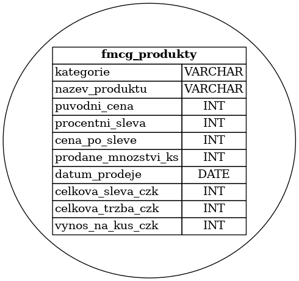
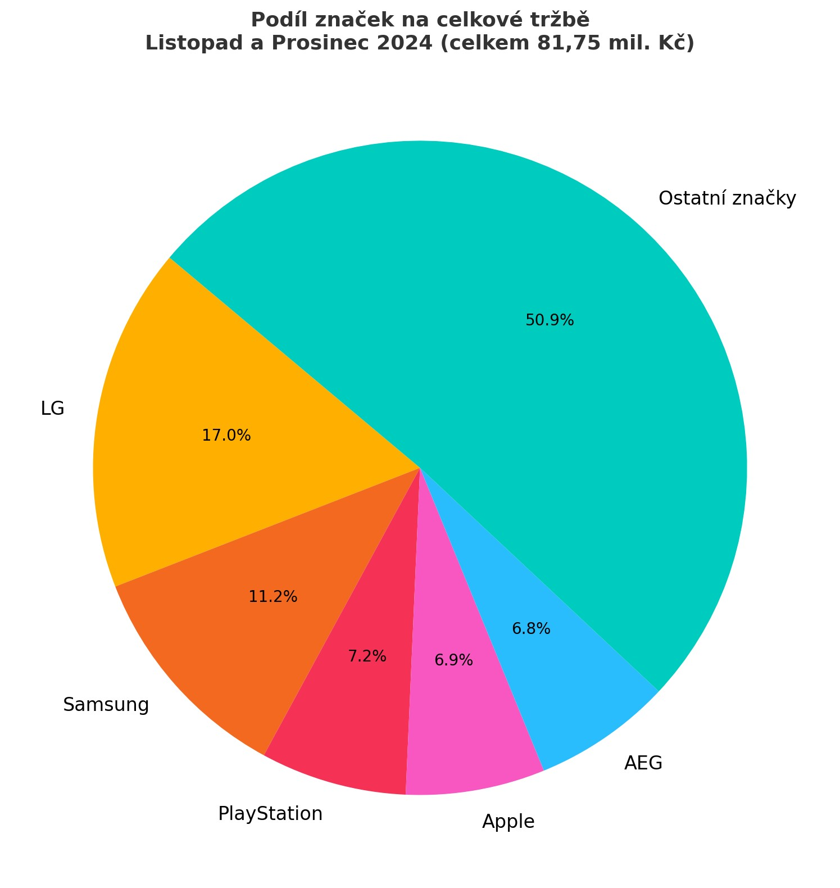

# FMCG – Analýza prodeje spotřebního zboží / FMCG Sales & Margin Case Study

Tento datový projekt analyzuje prodeje a ziskovost ve fiktivním prostředí maloobchodního FMCG segmentu. Pomocí SQL dotazů a Python vizualizací jsou zkoumány tržby, slevy, marže a sezónní trendy. / This data project analyzes sales and profitability in a fictional retail FMCG environment. Using SQL queries and Python visualizations, it explores revenues, discounts, margins, and seasonal trends.

## Obsah

Porovnat výkon značek a kategorií napříč měsíci
Analyzovat dopad slev na zisk a marži
Zjistit, které značky dominují v klíčových obdobích (např. před Vánoci)
Modelovat dopad snížení slev na ziskovost
Vytvořit predikci nejvýkonnějších kategorií pro jaro 2025

## Použité nástroje

- **MySQL** – pro tvorbu dotazů a výpočty tržeb, zisků, marží
- **Python (Pandas, Matplotlib, scikit-learn)** – pro analýzu, vizualizaci a predikce
- **Jupyter Notebook** – pro dokumentaci a exploraci
- **Excel/CSV** – datové vstupy
Použitý dataset pro analýzu:  
📊 [MegaSlevy_elektronika_FMCG_zbozi_Analyza.csv](./MegaSlevy_elektronika_FMCG_zbozi_Analyza.csv)
Dataset obsahuje očištěné údaje o prodejích, cenách, slevách a kategoriích produktů z období 2024.

## Klíčové výstupy

- Nejvyšší tržby byly zaznamenány u značek **iPhone, Samsung, Xiaomi** během prosince 2024
- Kategorie **TV, mobily a notebooky** měly příliš vysoké slevy → negativní dopad na marži
- Simulace ukázala, že **snížení slevy na 10 %** by významně zvýšilo celkový zisk
- Na základě sezónních trendů byla vytvořena predikce pro **jaro 2025**, kde dominuje:
  - Sport a outdoor
  - Kosmetika
  - Kávovary
  - Domácí spotřebiče

## Struktura složek / Folder structure

/images → Grafy, ERD diagram, vizualizace
/data → Očištěné datové soubory (.csv) 
/sql → SQL dotazy použití v analýze
/python → Jupyter notebooky, predikce, simulace
README.md → Tento soubor s popisem projektu



## Top 5 kategorií podle zisku a marže (12/2024)

```sql
SELECT 
  kategorie,
  SUM((cena_po_sleve - puvodni_cena) * prodane_mnozstvi_ks) AS celkovy_zisk_czk,
  ROUND(
    SUM((cena_po_sleve - puvodni_cena) * prodane_mnozstvi_ks) / 
    NULLIF(SUM(puvodni_cena * prodane_mnozstvi_ks), 0) * 100, 
    2
  ) AS marze_percent
FROM fmcg_produkty
WHERE MONTH(datum_prodeje) = 12 AND YEAR(datum_prodeje) = 2024
GROUP BY kategorie
ORDER BY celkovy_zisk_czk DESC
LIMIT 5;


SELECT 
  SUM(cena_po_sleve * prodane_mnozstvi_ks) AS celkova_trzba_czk
FROM fmcg_produkty
WHERE YEAR(datum_prodeje) = 2024 
  AND MONTH(datum_prodeje) IN (11, 12);

## Koláčový graf: Podíl značek na celkové tržbě
Období: Listopad + Prosinec 2024
Celková tržba: 81 752 162 Kč
Graf naleznete na závěr projektu
---
## Top značky podle tržby (11–12/2024)

```sql
SELECT 
  LEFT(nazev_produktu, INSTR(nazev_produktu, ' ') - 1) AS znacka,
  SUM(cena_po_sleve * prodane_mnozstvi_ks) AS celkova_trzba_czk
FROM fmcg_produkty
WHERE YEAR(datum_prodeje) = 2024 AND MONTH(datum_prodeje) IN (11, 12)
GROUP BY znacka
ORDER BY celkova_trzba_czk DESC
LIMIT 5;

```
## Průměrná sleva a zisk podle kategorií (2024)

```sql
SELECT 
  kategorie,
  ROUND(AVG(procentni_sleva), 2) AS prumerna_sleva_pct,
  ROUND(SUM((cena_po_sleve - puvodni_cena) * prodane_mnozstvi_ks), 0) AS celkovy_zisk_czk
FROM fmcg_produkty
WHERE YEAR(datum_prodeje) = 2024
GROUP BY kategorie
ORDER BY celkovy_zisk_czk;
```
## Simulace zisku při nižší slevě

| Kategorie            | Zisk (15–16 %) | Zisk (10 %) | Rozdíl    |
|----------------------|----------------|-------------|-----------|
| TV a foto            | 1,575 mil. Kč  | 1,050 mil. Kč | –525 000 Kč |
| Mobily a hodinky     | 1,760 mil. Kč  | 1,100 mil. Kč | –660 000 Kč |
| Počítače a notebooky | 899 tis. Kč    | 725 tis. Kč  | –174 000 Kč |

## Nejprodávanější produkt 2024

```sql
SELECT 
  nazev_produktu,
  SUM(prodane_mnozstvi_ks) AS celkove_kusy
FROM fmcg_produkty
WHERE YEAR(datum_prodeje) = 2024
GROUP BY nazev_produktu
ORDER BY celkove_kusy DESC
LIMIT 1;
```
## Analýza výkonu značek mobilních telefonů (11–12/2024)

Následující SQL dotaz zjišťuje, jak si jednotlivé značky mobilních telefonů vedly během klíčového předvánočního období – v listopadu a prosinci 2024:

```sql
SELECT 
  LEFT(nazev_produktu, INSTR(nazev_produktu, ' ') - 1) AS znacka,
  MONTH(datum_prodeje) AS mesic,
  SUM(cena_po_sleve * prodane_mnozstvi_ks) AS trzby_czk
FROM fmcg_produkty
WHERE 
  kategorie = 'Mobily a hodinky'
  AND YEAR(datum_prodeje) = 2024
  AND MONTH(datum_prodeje) IN (11, 12)
GROUP BY znacka, mesic
ORDER BY trzby_czk DESC;

Závěry z grafu: Všechny značky zaznamenaly vyšší tržby v prosinci. Největší nárůst zaznamenal Samsung – tržby přes 7,5 mil. Kč.
Huawei prodával pouze v listopadu, ostatní značky dominovaly v prosinci.
Tento výstup je ideálním podkladem pro marketingové plánování předvánočních kampaní.

```


## Predikce prodeje na leden 2025

Python skript -`predikce_leden_2025.py` s využitím lineární regrese.
import pandas as pd
from sklearn.linear_model import LinearRegression
import matplotlib.pyplot as plt

# Vzorová historická data
data = pd.DataFrame({
    'rok': [2023, 2023, 2023, 2024, 2024, 2024],
    'mesic': [11, 12, 1, 11, 12, 1],
    'kategorie': ['Elektronika'] * 6,
    'mnozstvi': [2400, 3100, 1200, 2600, 3400, 1300]
})

# Časový sloupec
data['datum'] = pd.to_datetime(dict(year=data.rok, month=data.mesic, day=1))
data['timestamp'] = data['datum'].astype(int) // 10**9
# Regresní model
X = data[['timestamp']]
y = data['mnozstvi']
model = LinearRegression()
model.fit(X, y)

# Predikce pro leden 2025
from datetime import datetime
leden_2025 = pd.to_datetime('2025-01-01')
ts_leden = int(leden_2025.timestamp())
predicted_qty = model.predict([[ts_leden]])

# Výstup
print(f'Odhadované množství prodané v lednu 2025: {int(predicted_qty[0])} ks')

# Graf
plt.figure(figsize=(10, 6))
plt.plot(data['datum'], y, marker='o', label='Historická data')
plt.axvline(leden_2025, color='red', linestyle='--', label='Leden 2025 (predikce)')
plt.scatter([leden_2025], [predicted_qty], color='red', zorder=5)
plt.title('Modelace prodaného množství (Listopad–Leden)')
plt.xlabel('Datum')
plt.ylabel('Prodáno ks')
plt.legend()
plt.grid(True)
plt.tight_layout()
plt.show()

Predikci množství prodaného v lednu 2025 pomocí lineární regrese 📈


## Predikce jaro 2025 na základě sezónního chování a výkonnosti kategorií během celého roku 😉
Postup:
1.	Projdem výkonnost kategorií napříč měsíci
2.	Vyberem ty, které:
o	mají silný výskyt v jarních měsících (březen–květen)
o	rostou nebo mají stabilní prodeje
3.	Vytvořím predikovaný žebříček kategorií pro jaro 2025

| Kategorie           | Doporučení            |
|---------------------|------------------------|
| Sport a outdoor     | Nejvyšší tržby         |
| Kosmetika           | Stabilní výkon         |
| Domácí spotřebiče   | Doporučeno pro promo   |
| Kávovary            | Dobrá marže            |
| Mobily a hodinky    | Nízká priorita na jaře |

## Shrnutí pro případovou studii:
Na základě vývoje kategorií napříč rokem a jejich výskytu v jarním období jsem identifikovala čtyři klíčové segmenty pro období březen–květen 2025:
Žebříček kategorií pro jaro 2025:
1.	Sport a outdoor – odhad tržby 7,5 mil. Kč
2.	Kosmetika – stabilní výkon, 5,2 mil. Kč
3.	Domácí spotřebiče – doporučeno pro promo
4.	Kávovary – dobrý poměr tržby a marže
Tyto kategorie doporučuji podpořit marketingově i zásobováním, protože v předchozích obdobích vykazovaly stabilní růst nebo silnou sezónní poptávku.


## Koláčový graf: Podíl značek na celkové tržbě  
Období: Listopad + Prosinec 2024
Celková tržba: 81 752 162 Kč


## Zisk a marže podle kategorie_prosinec 2024


## Doporučený závěrem
> „Slevy nad 15 % u drahého zboží (mobily, TV, PC) způsobují výrazné ztráty. Doporučujeme stanovit interní strop na slevy a aktivně sledovat ziskovost během kampaní jako Black Friday.“

## 📂 Dataset

Použitý dataset `MegaSlevy_elektronika_FMCG_zbozi_Analyza.csv` obsahuje **simulovaná prodejní data** ze segmentů **FMCG a elektroniky** během promo období (např. Vánoce, Black Friday).

Sloupce zahrnují:
- kategorii a název produktu,
- typ promo akce,
- původní a zlevněnou cenu,
- měnu (CZK) 
- počet prodaných kusů,
- výpočet tržeb a marže.

Soubor je uložen ve složce `/data` tohoto repozitáře. Data byla ručně vytvořena pro účely BI analýzy – slouží k vyhodnocení efektivity promo akcí a výnosnosti produktových kategorií.
