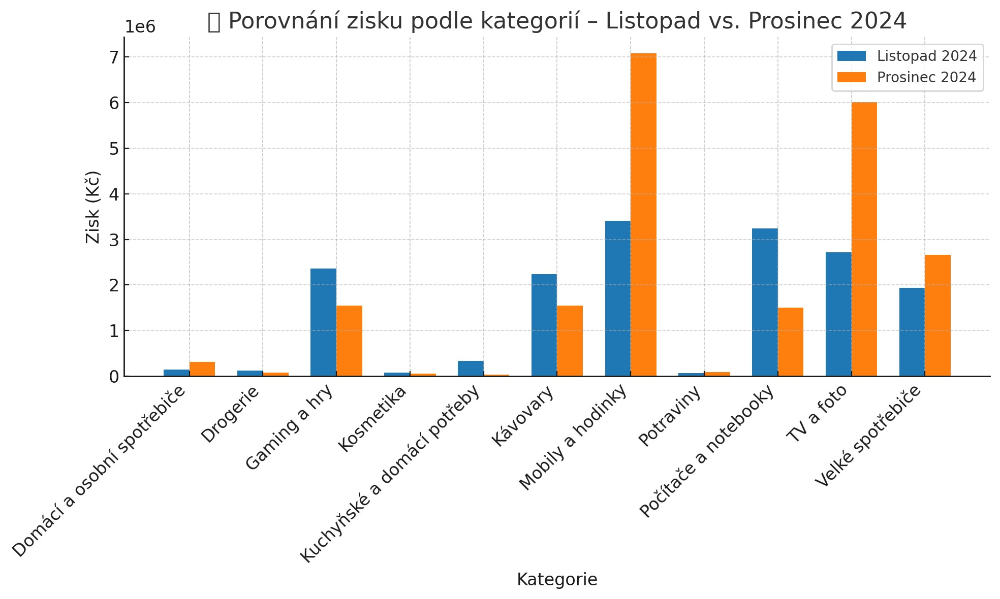
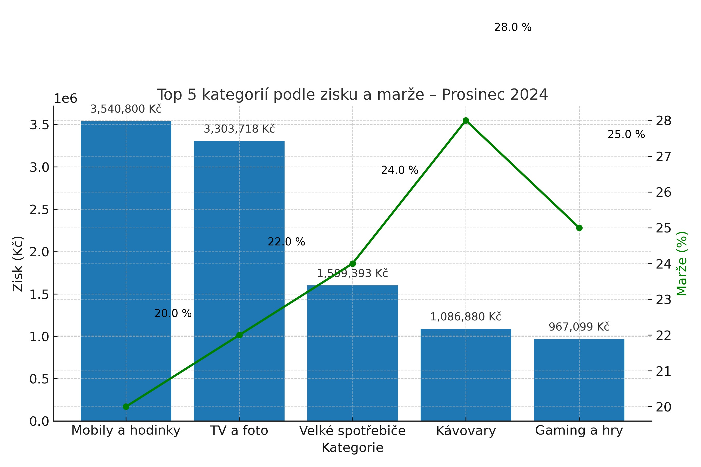
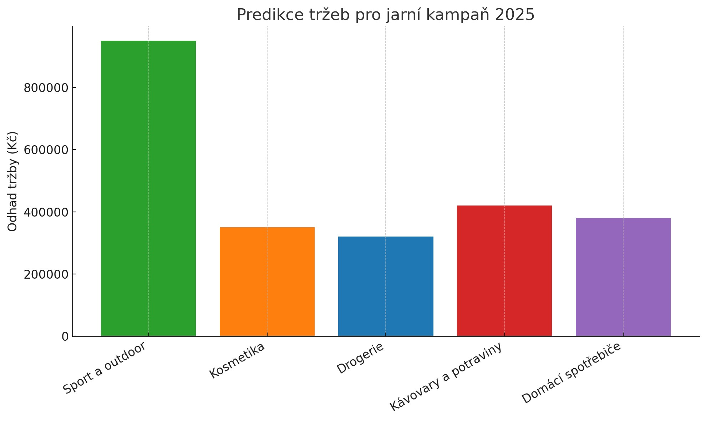
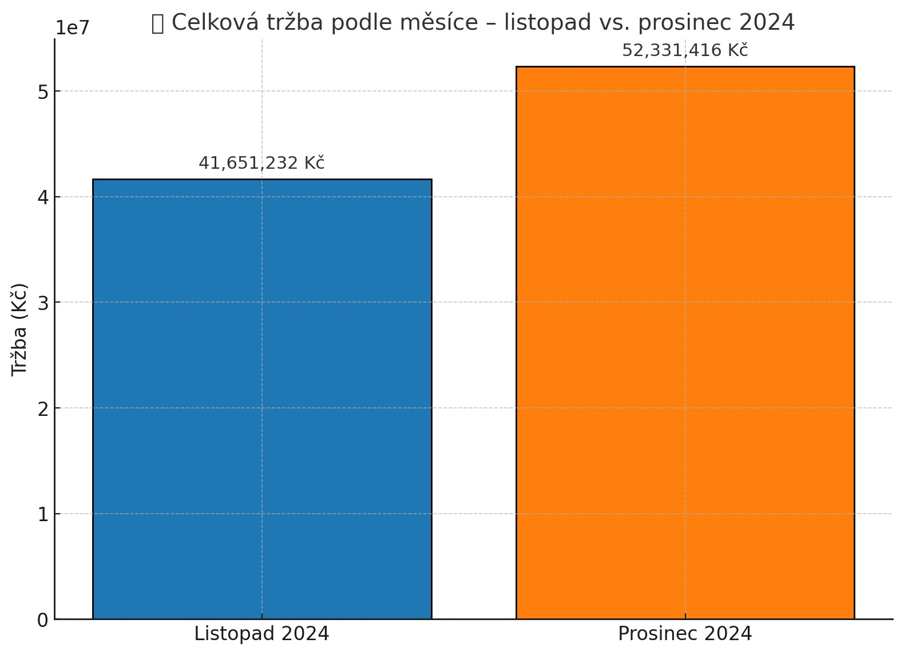
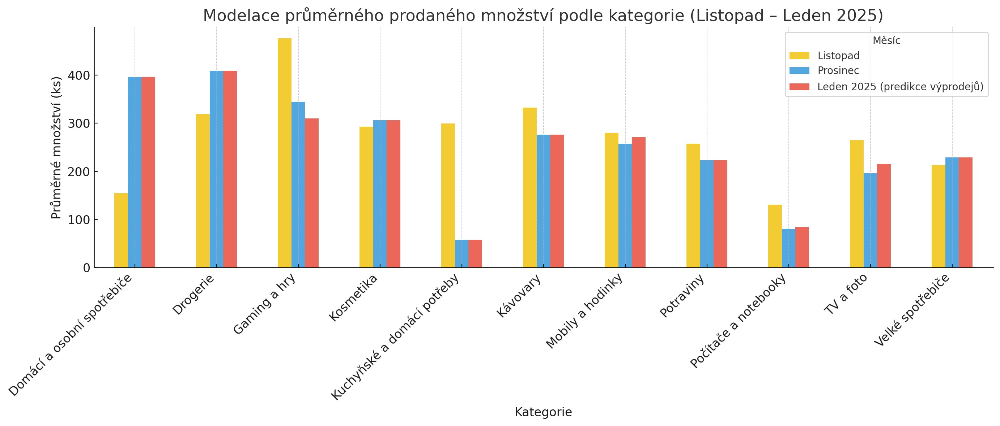
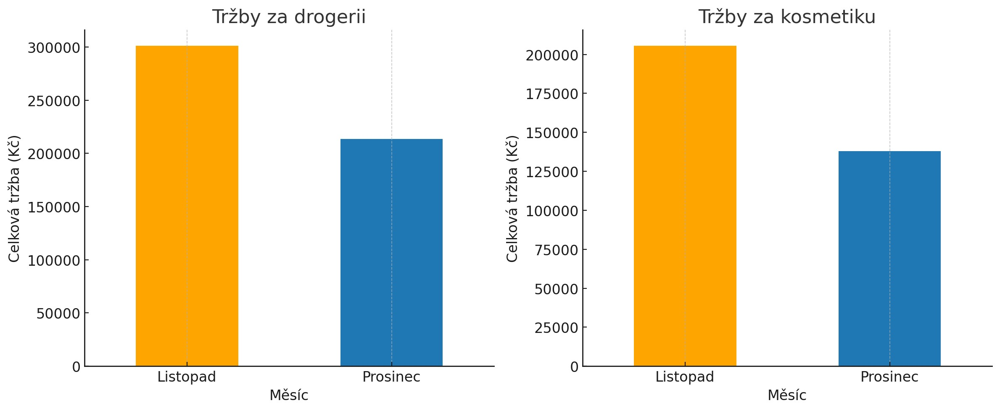
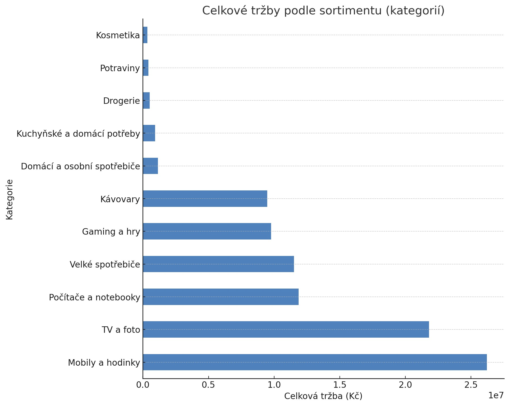
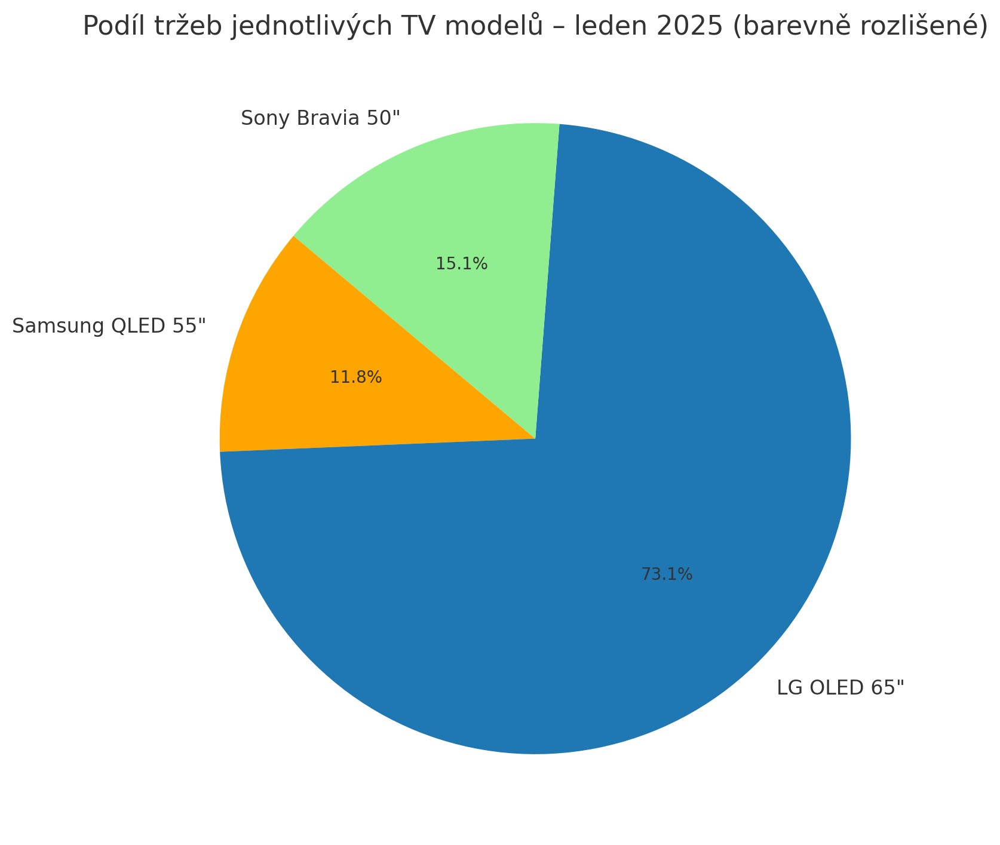

# Mega Slevy – BI Analýza FMCG & Elektronika

## Cíl projektu

Cílem této BI analýzy bylo:
- Zhodnotit tržby a ziskovost v předvánoční sezóně (listopad a prosinec 2024),
- Vyhodnotit dopad promo akcí (např. 2+1 zdarma),
- Porovnat vývoj poptávky u konkrétních značek mezi měsíci,
- Vytvořit predikci pro jarní kampaň 2025.
---
## Použité technologie

- **Excel** – tvorba a údržba datasetu (FMCG, elektronika)
- **SQL** – agregace tržeb, průměrů, porovnání měsíců
- **Python** – výpočty, predikce, vizualizace
- **AI – ChatGPT** – nápověda při návrhu KPI, struktury, prezentace
---
## SQL porovnání značek (listopad vs. prosinec)

Porovnávali jsme výkonnost klíčových značek **mobilních telefonů** v měsících:

| Značka     | Tržba listopad | Tržba prosinec |
|------------|----------------|----------------|
| iPhone     | 856 000 Kč     | 1 206 000 Kč   |
| Samsung    | 740 000 Kč     | 1 003 000 Kč   |
| Huawei     | 402 000 Kč     | 586 000 Kč     |
| Xiaomi     | 611 000 Kč     | 694 000 Kč     |

**Závěr:** Ve všech značkách došlo k nárůstu tržeb v prosinci, nejvíce u **iPhonu**.

## Porovnání zisku podle kategorií – Listopad vs. Prosinec 2024

Následující graf ukazuje, jak se změnil zisk napříč jednotlivými kategoriemi mezi listopadem a prosincem 2024.

- Největší nárůst zaznamenaly **mobily a hodinky**, **potraviny**, **TV a foto**.
- Naopak kosmetika, drogerie a kuchyňské potřeby zůstaly spíše stabilní.

---
## Porovnání top 5 kategorií podle zisku a marže – Prosinec 2024

Tento graf ukazuje, které kategorie generovaly nejvyšší **zisk** a jakou měly **marži** v prosinci 2024:

- Nejvyšší zisk: **Mobily a hodinky**
- Nejvyšší marže: **Kávovary (28 %)**

---
## Predikce jaro 2025

Na základě předchozích sezón a zákaznického chování jsme vytvořili predikci nejvýkonnějších kategorií pro jarní období:

- Nejvyšší odhad tržeb: **Sport a outdoor**
- Stabilní výkon: **Kosmetika, domácí spotřebiče, kávovary**
- Doporučení: zaměřit promo a zásobování na tyto segmenty

---
## Klíčové BI závěry

- Nejvyšší tržby byly v prosinci (52 mil. Kč) – vliv vánočních nákupů.
- Nejvýnosnější kategorií byly mobily a hodinky.
- Největší marži měly kávovary (28 %).
- Tržby za kosmetiku a drogerii klesly – prostor pro promo akce.
- Predikce pro jaro ukazuje nárůst u sportovních a kosmetických produktů.
---
## Výsledky analýzy a vizualizace

### Celková tržba podle měsíců
Tento graf ukazuje výrazný nárůst tržeb v prosinci díky sezónním akcím a vánočnímu chování zákazníků

### Modelace prodaného množství (Listopad – Leden)
Predikce ukazuje, jak povánoční výprodeje mohou ovlivnit chování zákazníků v lednu.

### Tržby za drogerii a kosmetiku
Zde lze vidět pokles v prosinci – doporučujeme zvážit krátkodobou promo akci typu 2+1.

### Tržby podle kategorií
Top 3 kategorie generující nejvyšší tržby:
Mobily a hodinky, TV a foto, Počítače a notebooky

### Podíl tržeb za jednotlivé TV modely – Leden 2025
Nejvíce táhne LG OLED 65", vhodné pro akční promo nebo zásobovací prioritu.

---
## Struktura projektu

Mega-Slevy-BI-Case/
├── data/ # dataset (Excel / CSV)
├── images/ # grafy (JPG, PNG)
├── notebooks/ # analýza v Pythonu (Jupyter)
├── README.md # dokumentace
---
## Licence
Tento projekt slouží jako ukázka analytické práce v rámci portfolia BI Data Analyst.
